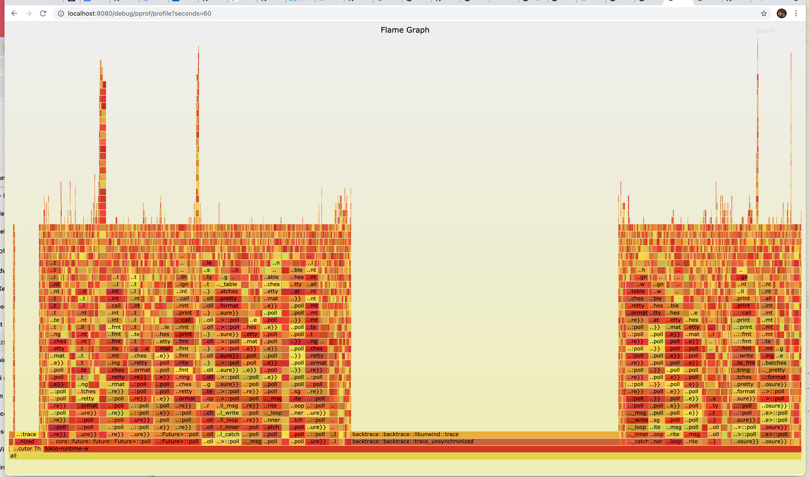

# IOx — Profiling

IOx includes an embedded `pprof` exporter compatible with the [go pprof](https://golang.org/pkg/net/http/pprof/) tool.

To use it, aim your favorite tool at your IOx host at the HTTP `/debug/pprof/profile` endpoint.

# Use the Go `pprof` tool:

Example

```shell
go tool pprof 'http://localhost:8080/debug/pprof/profile?seconds=5'
```

And you get output like:

```
Fetching profile over HTTP from http://localhost:8080/debug/pprof/profile?seconds=5
Saved profile in /Users/mkm/pprof/pprof.cpu.006.pb.gz
Type: cpu
Entering interactive mode (type "help" for commands, "o" for options)
(pprof) top
Showing nodes accounting for 93, 100% of 93 total
Showing top 10 nodes out of 185
      flat  flat%   sum%        cum   cum%
        93   100%   100%         93   100%  backtrace::backtrace::libunwind::trace
         0     0%   100%          1  1.08%  <&str as nom::traits::InputTakeAtPosition>::split_at_position1_complete
         0     0%   100%          1  1.08%  <(FnA,FnB) as nom::sequence::Tuple<Input,(A,B),Error>>::parse
         0     0%   100%          1  1.08%  <(FnA,FnB,FnC) as nom::sequence::Tuple<Input,(A,B,C),Error>>::parse
         0     0%   100%          5  5.38%  <F as futures_core::future::TryFuture>::try_poll
         0     0%   100%          1  1.08%  <T as alloc::slice::hack::ConvertVec>::to_vec
         0     0%   100%          1  1.08%  <alloc::alloc::Global as core::alloc::Allocator>::allocate
         0     0%   100%          1  1.08%  <alloc::borrow::Cow<B> as core::clone::Clone>::clone
         0     0%   100%          3  3.23%  <alloc::vec::Vec<T,A> as alloc::vec::spec_extend::SpecExtend<T,I>>::spec_extend
         0     0%   100%          1  1.08%  <alloc::vec::Vec<T,A> as core::iter::traits::collect::Extend<T>>::extend
```

# Use the built in flame graph renderer

IOx also knows how to render a flamegraph SVG directly if opened directly in the browser:

For example, if you aim your browser at an IOx server with a URL such as http://localhost:8080/debug/pprof/profile?seconds=5

You will see a beautiful flame graph such as


